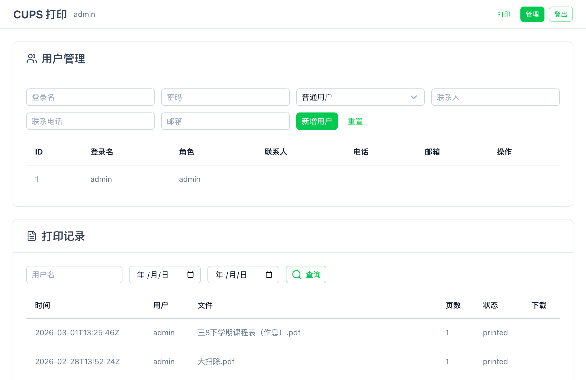

# 🖨️ CUPS Web — 网页打印管理

[](https://hub.docker.com/r/hanxi/cups-web)
[](https://github.com/hanxi/cups-web)
[](LICENSE)

基于 CUPS 的网页版打印管理工具。通过浏览器上传文件、远程提交打印任务，支持多用户管理与打印记录追踪，适合家庭和小型办公室使用。

## 📸 界面预览

<div align="center">
<table>
  <tr>
    <td align="center"><br/><b>文件上传</b></td>
    <td align="center"><br/><b>打印机选择</b></td>
  </tr>
  <tr>
    <td align="center"><br/><b>实时预览</b></td>
    <td align="center"><br/><b>管理后台</b></td>
  </tr>
</table>
</div>

## ✨ 功能特性

### 打印能力

- **多格式支持**：PDF、图片（JPG/PNG/GIF/HEIC）、Office 文档（doc/docx/xls/xlsx/ppt/pptx）、OFD、纯文本
- **自动转换**：Office 文档通过 LibreOffice 转 PDF；OFD 通过内置 Java 转换器（基于 ofdrw）转 PDF；文本/图片在服务端渲染为 PDF
- **多图片合并打印**：一次选择多张图片自动合并为一份 PDF
- **打印选项**：份数、单双面、彩色/黑白、纸张大小、纸张类型、页面方向、页码范围、缩放、镜像打印
- **实时预览**：支持 PDF 预览、纸张方向的可视化预览、页数估算

### 用户与权限

- **多用户系统**：支持 `admin` / `user` 两种角色
- **默认管理员**：首次启动自动创建 `admin/admin`，`admin` 账号受保护无法被删除或重命名
- **打印记录**：完整保存每次打印的文件、页数、份数、双面/彩色选项、状态等

### 管理后台

- **用户管理**：创建、编辑、删除用户；修改角色与联系信息
- **打印记录查询**：可按用户名、时间范围过滤
- **数据保留策略**：按天数自动清理过期打印记录和对应文件（每小时巡检一次）

### 安全

- **Session 认证**：基于 Gorilla `securecookie`（加密 + 签名），密钥自动生成并持久化到数据库
- **CSRF 防护**：对所有非 GET/HEAD/OPTIONS 请求校验 `X-CSRF-Token`
- **密码安全**：bcrypt 加密存储

## 🛠️ 技术栈

- **后端**：Go 1.26 · Gorilla Mux · SQLite（`modernc.org/sqlite`，纯 Go 实现，无需 CGO）
- **打印协议**：[OpenPrinting/goipp](https://github.com/OpenPrinting/goipp)（IPP）
- **前端**：Vue 3 · Vite 7 · [Nuxt UI v4](https://ui.nuxt.com/) · Tailwind CSS v4 · Vue Router（hash 模式）
- **文档转换**：LibreOffice（Office → PDF）· [ofdrw](https://github.com/ofdrw/ofdrw)（OFD → PDF，Java 17）
- **打印服务**：[CUPS](https://www.cups.org/)

## 🚀 快速开始

提供两种部署方式：

- [Docker 部署](#docker-部署)（推荐，一键拉起 CUPS + Web）
- [二进制部署](#二进制部署)（适合已有 CUPS 服务的场景）

---

## Docker 部署

### 前置要求

- Docker 与 Docker Compose
- USB 打印机（若使用本地打印机）

### 1. 创建 `docker-compose.yml`

```yaml
services:
  cups:
    image: hanxi/cups:latest
    user: root
    environment:
      - CUPSADMIN=${CUPSADMIN}
      - CUPSPASSWORD=${CUPSPASSWORD}
    ports:
      - "631:631"
    devices:
      - /dev/bus/usb:/dev/bus/usb
    volumes:
      - ./.etc:/etc/cups
    restart: unless-stopped

  web:
    image: hanxi/cups-web:latest
    user: root
    environment:
      - CUPS_HOST=cups:631
    volumes:
      - ./.data:/data
      - ./.uploads:/uploads
    ports:
      - "1180:8080"
    depends_on:
      - cups
    restart: unless-stopped
```

也可直接下载仓库内的 `docker-compose.yml`：

```bash
wget https://raw.githubusercontent.com/hanxi/cups-web/master/docker-compose.yml
```

### 2. 配置环境变量

在同目录创建 `.env`：

```bash
CUPSADMIN=admin
CUPSPASSWORD=your_cups_password
```

### 3. 启动服务

```bash
docker-compose up -d
```

### 4. 配置打印机

访问 CUPS 管理界面：<http://localhost:631>，使用 `.env` 中的账号登录并添加打印机。

> ⚠️ **重要**：添加打印机后，必须在 CUPS 管理后台将其设为 **Shared（共享）** 状态，否则 Web 端无法发现该打印机。

### 5. 访问 Web

浏览器打开 <http://localhost:1180>，使用默认账号登录：

- 用户名：`admin`
- 密码：`admin`

> ⚠️ **首次登录请立即修改默认密码**。

---

## 二进制部署

适合已有 CUPS 服务的场景。

### 1. 下载二进制

从 [GitHub Releases](https://github.com/hanxi/cups-web/releases) 下载对应平台的二进制：

| 平台 | 架构 | 文件名 |
| --- | --- | --- |
| Linux | amd64 | `cups-web-linux-amd64` |
| Linux | arm64 | `cups-web-linux-arm64` |
| macOS | amd64 | `cups-web-darwin-amd64` |
| macOS | arm64 | `cups-web-darwin-arm64` |
| Windows | amd64 | `cups-web-windows-amd64.exe` |

```bash
wget https://github.com/hanxi/cups-web/releases/latest/download/cups-web-linux-amd64
chmod +x cups-web-linux-amd64
```

### 2. 配置并运行

```bash
export CUPS_HOST=localhost:631
export DB_PATH=./data/cups-web.db
export UPLOAD_DIR=./uploads
export LISTEN_ADDR=:8080

./cups-web-linux-amd64
```

或使用命令行参数（优先级高于环境变量）：

```bash
./cups-web-linux-amd64 -addr :8080
```

> ⚠️ **OFD 打印仅在 Docker 镜像中开箱即用**。二进制部署若需支持 OFD，需要另行安装 Java 17 并把 `ofd-converter.jar` 放到 `/ofd-converter.jar`（或手动改源码中的路径）。

### 3. 访问 Web

浏览器打开 <http://localhost:8080>，使用 `admin/admin` 登录。

---

## ⚙️ 配置说明

### 环境变量

| 变量名 | 说明 | 默认值 |
| --- | --- | --- |
| `LISTEN_ADDR` | Web 服务监听地址 | `:8080` |
| `DB_PATH` | SQLite 数据库路径 | `data/cups-web.db` |
| `UPLOAD_DIR` | 上传文件目录 | `uploads` |
| `CUPS_HOST` | CUPS 服务地址（`host` 或 `host:port`） | `localhost` |

### 命令行参数

| 参数 | 说明 |
| --- | --- |
| `-addr` | 监听地址，优先级高于 `LISTEN_ADDR` |

### CUPS 容器环境变量

| 变量名 | 说明 |
| --- | --- |
| `CUPSADMIN` | CUPS 管理员用户名（**必填**） |
| `CUPSPASSWORD` | CUPS 管理员密码（**必填**） |

### 默认端口

- CUPS：`631`
- Web：容器内 `8080`，`docker-compose.yml` 默认映射到宿主机 `1180`

### 数据持久化目录

Docker 默认卷映射：

- `./.data` → 数据库
- `./.uploads` → 上传的原始文件与转换后 PDF
- `./.etc` → CUPS 配置

---

## 📖 使用指南

### 支持的文件格式

| 类型 | 扩展名 | 处理方式 |
| --- | --- | --- |
| PDF | `.pdf` | 直接打印 |
| 图片 | `.jpg` `.jpeg` `.png` `.gif` `.heic` | 转换为 PDF（支持多张合并） |
| Office | `.doc` `.docx` `.xls` `.xlsx` `.ppt` `.pptx` | 通过 LibreOffice 转换 |
| OFD | `.ofd` | 通过 ofdrw 转换 |
| 文本 | `.txt` `.md` `.html` | 服务端渲染为 PDF |

### 打印流程

1. 选择打印机
2. 上传文件（支持多图）
3. 预览转换后的 PDF、调整打印参数
4. 确认提交，系统自动落库并下发到 CUPS

### 管理员功能

- **用户管理**：创建、编辑、删除；默认 `admin` 账号不可删除、不可改名、角色固定
- **打印记录**：查看全站记录，按用户名/日期过滤，下载原始文件
- **系统设置**：数据保留天数（`0` 表示永久保留）

---

## 🔧 进阶配置

### 使用 HTTPS

通过反向代理（例如 Nginx）提供 HTTPS：

```nginx
server {
    listen 443 ssl;
    server_name example.com;

    ssl_certificate     /path/to/cert.pem;
    ssl_certificate_key /path/to/key.pem;

    location / {
        proxy_pass http://localhost:1180;
        proxy_set_header Host $host;
        proxy_set_header X-Real-IP $remote_addr;
        proxy_set_header X-Forwarded-For $proxy_add_x_forwarded_for;
        proxy_set_header X-Forwarded-Proto $scheme;
    }
}
```

### 修改端口

编辑 `docker-compose.yml`：

```yaml
services:
  web:
    ports:
      - "你的端口:8080"
```

### 数据备份

```bash
cp ./.data/cups-web.db /backup/location/
tar -czf uploads-backup.tar.gz ./.uploads/
tar -czf cups-config-backup.tar.gz ./.etc/
```

---

## ❓ 常见问题

### 忘记管理员密码怎么办？

删除数据库文件后重启即可重置为默认 `admin/admin`（**会丢失全部数据**）：

```bash
docker-compose down
rm ./.data/cups-web.db
docker-compose up -d
```

### Web 端看不到打印机？

1. 检查打印机是否在 CUPS 中正常列出（<http://localhost:631>）
2. 确认打印机设置为 **Shared**
3. 容器化部署时确认 `CUPS_HOST` 指向正确的 CUPS 服务地址
4. 重启 CUPS：`docker-compose restart cups`

### Office / OFD 转换失败？

- 转换有 **60 秒超时**，复杂文档可能超时
- 确认文档本身未损坏；可尝试本地先另存为 PDF 再上传
- 查看日志：`docker-compose logs -f web`

### 上传文件一直堆积占空间？

在「管理后台 → 系统设置」中设置「数据保留天数」为大于 0 的值，维护任务每小时巡检一次，自动清理过期记录与文件。

### 如何查看日志？

```bash
docker-compose logs -f web
docker-compose logs -f cups
```

---

## 🤝 贡献

欢迎提 Issue 和 Pull Request。开发者文档请参阅 [AGENTS.md](AGENTS.md)。

## 💖 支持项目

如果这个项目对你有帮助，欢迎通过以下方式支持：

### ⭐ Star 项目

点击右上角的 ⭐ Star 按钮，让更多人发现这个项目。

### 💰 赞赏支持

- [💝 爱发电](https://afdian.com/a/imhanxi) — 持续支持项目发展
- 扫码请作者喝杯奶茶 ☕

<p align="center">
  
</p>

感谢你的支持！❤️

## 📄 许可证

本项目采用 MIT 许可证，详见 [LICENSE](LICENSE)。
